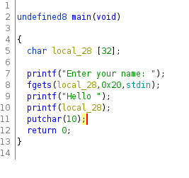
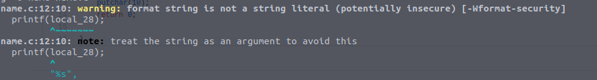

# 10 - Common software vulnerabilities

### 1. Decompilation and analysis of an x64 binary

Når vi dekompilerer binærfila i ghidra får vi ut main-en:

</br>



Her ser vi at printf() blir brukt uten å ta hensyn til hva brukeren skal skrive inn. Dette åpner opp for vulnerabilities som f.eks:
* Kræsje programmet med å foreksempel skrive: printf ("%s%s%s%s%s%s%s%s%s%s%s%s")
* Se innholde på stacken: printf ("%08x %08x %08x %08x %08x\n")

</br>

Om vi kompilerer vil vi få feilmeldingen som advarer om dette:

</br>



</br>

Om vi endrer koden slik at printf() tar hensyn til dette unngår vi at noen kan utnytte hva de kan skrive inn i programmet.
Dette gjør vi med å :

```bash
  #endrer fra
  printf(local_28);

  #til
  printf("%s",local_28);
```

### 2. Micro-CMS v1
#### FLAG 0
Fant ut at om man la til en ny page fikk den en id som var høyere enn antall pages man så. Etter å ha prøvd å gå inn på de forskjellige pagesene opp til iden min page fikk, fikk jeg tilbakemelding på at den ene pagen var forbidden.: 

</br>

http://34.74.105.127/6a58e1558b/page/4

</br>

Ved å da gå inn på:

</br>
http://34.74.105.127/6a58e1558b/page/edit/4
</br>

Fikk jeg opp siden med flagget.
</br>

#### FLAG 1
Dette fant jeg ved å SQLinjection:
</br>
http://34.74.105.127/6a58e1558b/page/edit/2'
</br>

#### FLAG 2
Om vi endrer en page sin overskrift til å includere et script slik som
</br>
`(<script>alert()</script>)`
</br>
Vil flagget komme i alerten som kjøres når vi går til hovedsiden.

#### FLAG 3
Om vi legger til en knapp når vi oppretter en side, og deretter går inn på inspiser vil flagge dukke opp i knappen.


