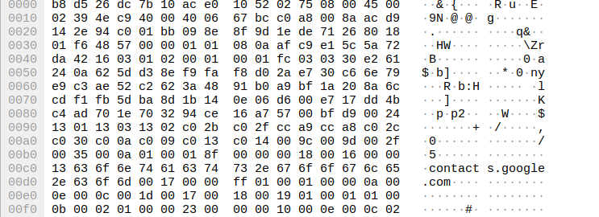

# 11 - Epost
## 1 Wireshark
Når vi bruker wireshark kan vil vi se at vi mottar mail, men mailen vil være kryptert. Siden vi ikke har private keyen som brukes vil vi ikke kunne dekryptere den sensitive informasjonen, slik som senderens mailadresse eller innholde til mailen. Her ser vi at dette oppnås med TLSv1.3.

Her ser vi at dataen er kryptert:

