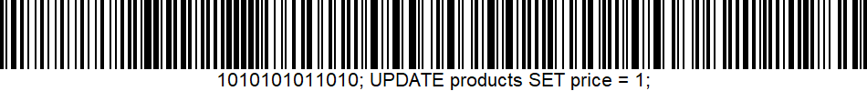
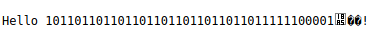
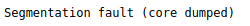
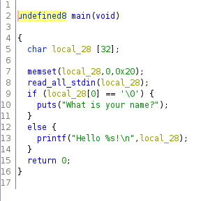
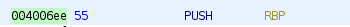

# 12 - Reverse engineering

## 1 - Exploit (and fix) a vulnerable point-of-sale (POS) system
Problemet med myshop.py er at den er sårbar for SQL injection. Dette er fordi iputet blir eksikvert direkte til databasen uten noen validering. Vi ser dette i linjen
```SQL
numrows = cur.execute("SELECT price FROM products WHERE id = %s" % barcode)
```
Om vår barcode f.eks. ser slik ut:

 vil databasen tolke dette som:
 ```SQL
SELECT price FROM products WHERE id = 1010101011010; UPDATE products SET price = 1;
```
noe som vil gjøre at prisen alltid vil koste 1kr. For å fikse dette kan vi skrive:
```SQL
numrows = cur.execute("SELECT price FROM products WHERE id = %s;", (barcode,))
```
Her er ```barcode``` sanitizert før den blir sendt i spørringen
## 2 - Hacker 101 CTF
Ser at om vi skriver inn f.eks.  
  
Får vi en buffer overflow, dette er en sårbarhet. Om vi skriver inn for mange tegn vil vi få en segmentation fault   
  
Om vi bruker Ghidra ser vi main:  
  
vi ser at vi har en funksjon ```print_falgs``` som har assembly koden  
   
Vi kan utnytte buffer overflow til å uføre koden i minnelokasjonen ``` 004006ee ``` altså funskjonen ```print_flags```. Dette gjør vi ved å sende inn følgende URL på nettsiden:  
```http://34.74.105.127/2f7dd23623/?stdin=0101101011010110101101011010110101101011%ee%06%40%00%00%00%00%00```  
og dermed får vi ut flagget.
