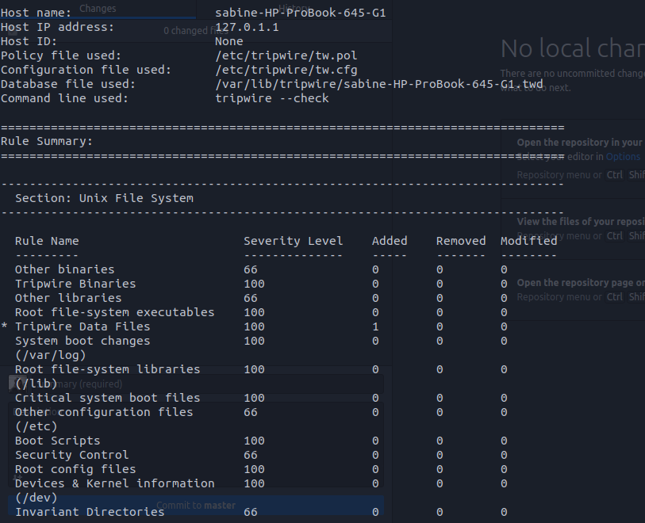
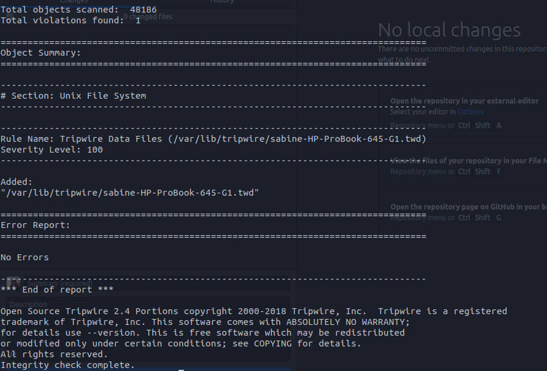
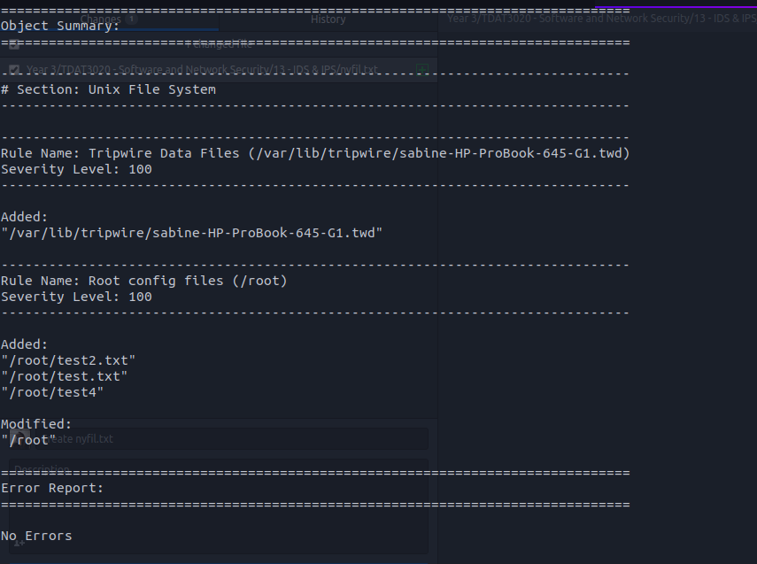
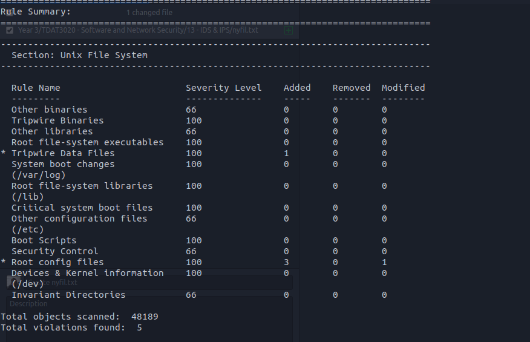

# 13 - IDS & IPS
## HIDS
Etter installasjon av tripwire kjører jeg ``` tripwire --check ``` og får følgende output  




Ser at vi får en vulnerability men denne kommer hver gang jeg kjører programmet, litt usikker på hvorfor.    

Jeg legger til to nye filer: 
```touch test.txt```
```touch test2.txt```
og en ny mappe:
```mkdir test4```
dette vil dermed vises som en vulnerability. Kjører dermed prrogrammet på nytt å ser at disse kommer opp  



## NIDS
