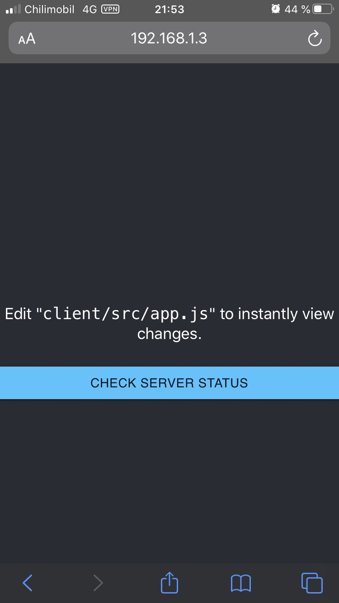

# 15 - VPN

Begynner med å laste ned OPenVPN med hjelp av https://github.com/Angristan/OpenVPN-install. Kjører kommandoene:  
```cmd
curl -O https://raw.githubusercontent.com/angristan/openvpn-install/master/openvpn-install.sh
```
Og deretter gjør jeg det mulig å kjøre scriptet for å installere OpenVPN  

```cmd
chmod +x openvpn-install.sh
```
Kjører scriptet og legger inn min offentlige IPv4 adresse.
Deretter åpner jeg 1194 porten på ruteren min for trafikk.  


Nå sender jeg Client.ovpn til telefonen min. Laster ned OpenVPN appen fra app store og laster inn fila der. 
Skrur på VPN-en 


Kjører et program på localhost  
  
og går inn på et kjørende program på localhost via 4g. Får da opp nettstedet, om jeg deretter slår av nettsiden vil ikke siden laste inn.



