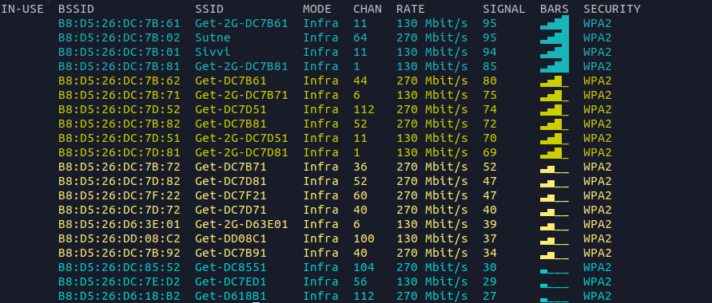
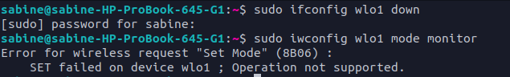
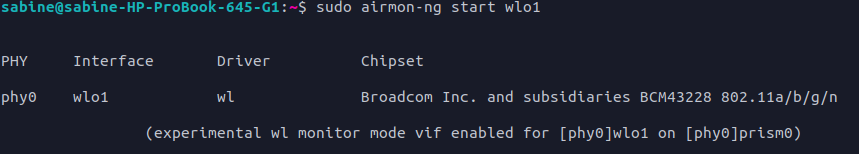
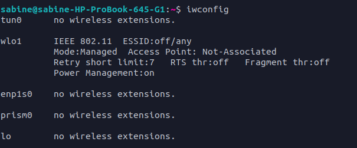

# Wireless Networks
Bruker kommandoen : 
```cmd
nmcli d wifi
```
og får opp nettverkene:  
  
Ut i fra dette ser vi at kanal 64 ikke har så mye trafikk, dermed kunne dette vært et godt valg for en ny kanal.

Skulle teste ut aircrack-ng og lastet dette ned, men støtet på et problem når jeg ikke får satt  nettverkskortet til PC-en i monitor modus.



