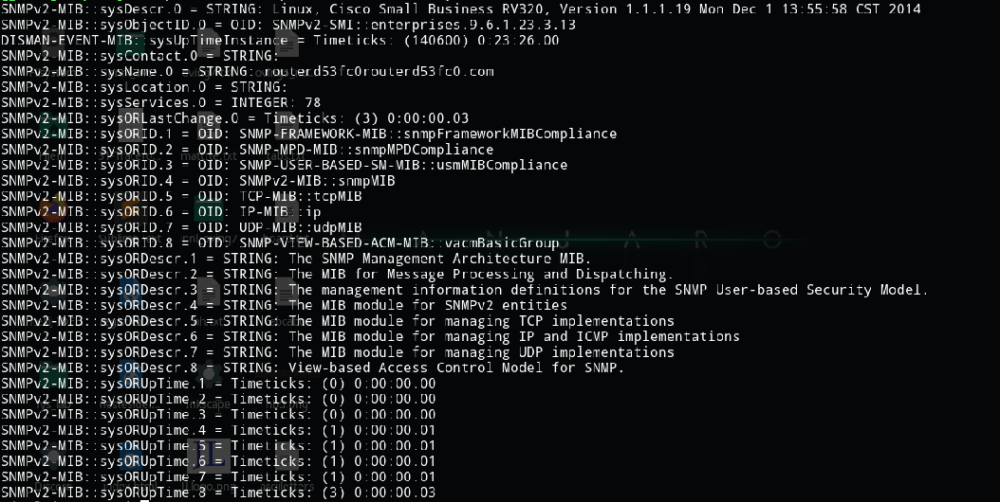
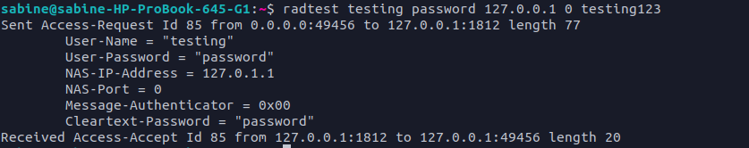
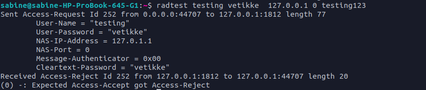

# 19 - Overvåking og logging
### SNMP
Kjører kommandoen  
```cmd
snmpwalk -v2c -c public 192.168.1.1 system
```  
og får ut  


### Autentiseringstjener
Prøvde å sette opp på hjemmeruteren med fikk ikke logget på. Bruker derfor freeradius.
Laster ned freeradius og legger inn en user i users filen. Tester deretter ved å logge på.

Sjekker at vi blir nektet avgang med et passord som ikke stemmer

