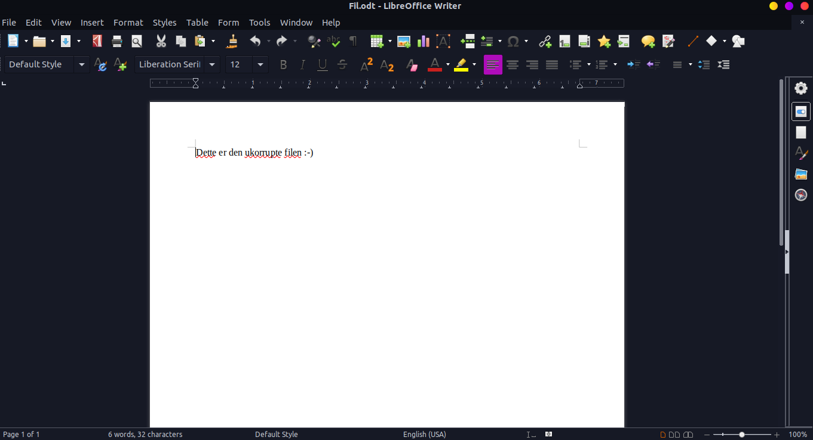
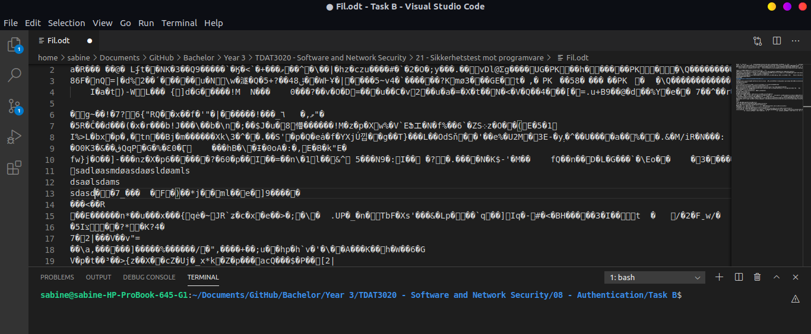
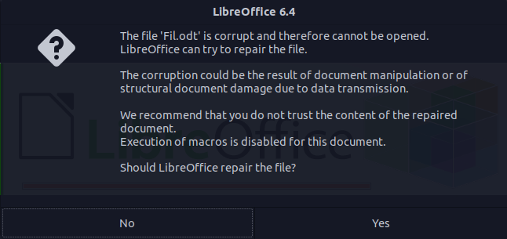
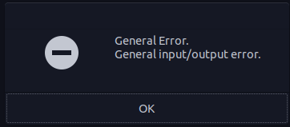

# 21 - Sikkerhetstest mot programvarer

Begynner med å opprette en odt fil i Libre office.
  
Etter filen er opprettet åpner jeg den i vs-code og endrer på den.  

Prøver deretter å åpne den igjen med Libre office. Vi får en advarsel men trykker åpne likevel.        
  
Får opp en feil og programmet kræsjer.    

